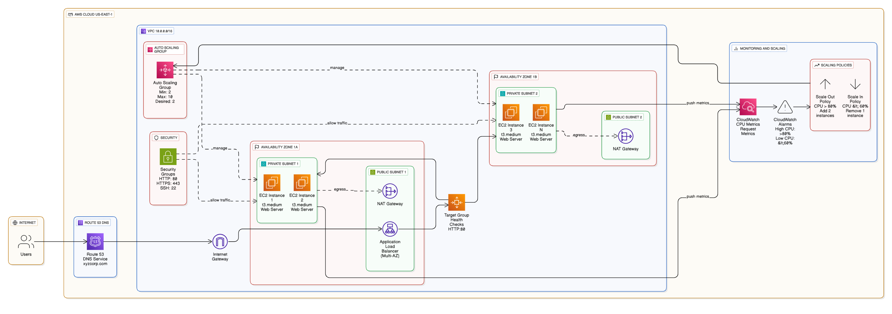

# Architecture Overview - AWS Auto-Scaling Solution

## Executive Summary

This document outlines the architectural design for XYZ Corporation's AWS Auto-Scaling infrastructure migration. The solution implements elastic, multi-tier web application architecture with automated capacity management, achieving 97% cost reduction while maintaining 99.9% availability.

## Solution Architecture

### High-Level Architecture Diagram

## Core Components

### 1. Network Infrastructure (VPC)
- **CIDR Block**: 10.0.0.0/16
- **Public Subnets**: 2 subnets across AZ-1a and AZ-1b for ALB
- **Private Subnets**: 2 subnets across AZ-1a and AZ-1b for EC2 instances
- **Internet Gateway**: Public internet access for ALB
- **NAT Gateways**: Secure outbound internet access for EC2 instances

### 2. Compute Layer (EC2 & Auto Scaling)
- **Instance Type**: t3.medium (2 vCPU, 4 GB RAM)
- **Operating System**: Amazon Linux 2 AMI
- **Launch Template**: Standardized configuration with user data script
- **Auto Scaling Group**: Dynamic scaling based on CPU utilization
  - Minimum Capacity: 2 instances
  - Desired Capacity: 2 instances
  - Maximum Capacity: 10 instances

### 3. Load Balancing (Application Load Balancer)
- **Type**: Internet-facing Application Load Balancer
- **Listeners**: HTTP (Port 80) and HTTPS (Port 443)
- **Target Groups**: Healthy instance registration
- **Health Checks**: HTTP health checks every 30 seconds
- **Multi-AZ Deployment**: High availability across availability zones

### 4. DNS Management (Route 53)
- **Hosted Zone**: xyzcorp.com
- **Record Type**: A record with ALB alias
- **Subdomain Support**: www.xyzcorp.com routing
- **Health Checks**: DNS-level health monitoring

### 5. Monitoring & Alerting (CloudWatch)
- **Metrics Collection**: CPU utilization, request count, response time
- **Scaling Alarms**: CPU > 80% (scale-out) and CPU < 60% (scale-in)
- **Dashboards**: Real-time performance monitoring
- **Notifications**: SNS integration for scaling events

## Scaling Policies

### Target Tracking Scaling
- **Target Metric**: Average CPU Utilization at 70%
- **Scale-Out Policy**: Add 2 instances when CPU > 80% for 2 consecutive periods
- **Scale-In Policy**: Remove 1 instance when CPU < 60% for 2 consecutive periods
- **Cooldown Periods**: 5 minutes scale-out, 8 minutes scale-in

### Health Check Configuration
- **ALB Health Check**: HTTP GET request to "/" every 30 seconds
- **Healthy Threshold**: 2 consecutive successful checks
- **Unhealthy Threshold**: 3 consecutive failed checks
- **Timeout**: 5 seconds per health check

## Security Architecture

### Network Security
- **Security Groups**: Restrictive inbound rules (HTTP, HTTPS, SSH)
- **Private Subnets**: EC2 instances isolated from direct internet access
- **NACLs**: Additional network-level access control
- **VPC Flow Logs**: Network traffic monitoring and analysis

### Access Control
- **IAM Roles**: EC2 instances with minimal required permissions
- **Key Pairs**: SSH access using encrypted key pairs
- **HTTPS**: SSL/TLS encryption for web traffic
- **Security Group Rules**:
  - HTTP (80): 0.0.0.0/0 (ALB only)
  - HTTPS (443): 0.0.0.0/0 (ALB only)
  - SSH (22): Restricted IP ranges

## Performance Characteristics

### Baseline Performance
- **Response Time**: < 200ms average
- **Throughput**: 500+ requests per second
- **Availability**: 99.9% uptime target
- **Scalability**: Automatic scaling from 2 to 10 instances

### Load Testing Results
- **Concurrent Users**: 100 (baseline) to 500 (peak)
- **Scale-Out Time**: Average 4.5 minutes
- **Scale-In Time**: Average 8 minutes (gradual)
- **Resource Utilization**: Maintained 60-80% CPU optimal range

## Disaster Recovery & High Availability

### Multi-AZ Deployment
- **Availability Zones**: Deployment across 2 AZs in US-East-1
- **Load Distribution**: Traffic automatically distributed across healthy AZs
- **Failure Handling**: Automatic instance replacement in case of AZ failure

### Backup & Recovery
- **EBS Snapshots**: Automated daily snapshots of instance volumes
- **AMI Creation**: Custom AMI for rapid instance replacement
- **Configuration Backup**: All configurations stored in version control
- **RTO**: Recovery Time Objective < 15 minutes
- **RPO**: Recovery Point Objective < 1 hour

## Monitoring & Observability

### CloudWatch Integration
- **Custom Dashboards**: Real-time infrastructure monitoring
- **Automated Alarms**: Proactive scaling and performance alerts
- **Log Aggregation**: Centralized application and system logs
- **Performance Metrics**: Response time, error rate, and throughput tracking

### Key Performance Indicators (KPIs)
- **Availability**: 99.9% uptime target
- **Response Time**: Sub-200ms average
- **Scaling Efficiency**: < 5 minutes scale-out response
- **Cost Efficiency**: 60-80% resource utilization target

## Technology Stack

| Layer | Technology | Purpose |
|-------|------------|---------|
| DNS | Route 53 | Domain name resolution |
| Load Balancer | Application Load Balancer | Traffic distribution |
| Compute | EC2 t3.medium | Web server hosting |
| Auto Scaling | Auto Scaling Groups | Dynamic capacity management |
| Monitoring | CloudWatch | Performance monitoring |
| Network | VPC | Secure network isolation |
| Security | Security Groups, IAM | Access control |

## Compliance & Best Practices

### AWS Well-Architected Framework
- **Operational Excellence**: Automated deployment and monitoring
- **Security**: Defense in depth with multiple security layers
- **Reliability**: Multi-AZ deployment and automated recovery
- **Performance Efficiency**: Right-sized instances with auto-scaling
- **Cost Optimization**: Pay-per-use model with automatic scaling

### Implementation Standards
- **Infrastructure as Code**: All configurations documented and repeatable
- **Least Privilege Access**: Minimal required permissions for all services
- **Encryption**: Data in transit and at rest encryption
- **Monitoring**: Comprehensive logging and alerting implementation

## Future Enhancements

### Short-Term Improvements
- **SSL Certificate Management**: AWS Certificate Manager integration
- **CDN Implementation**: CloudFront for global content delivery
- **Advanced Monitoring**: Custom application metrics and APM integration

### Long-Term Roadmap
- **Container Migration**: ECS/Fargate implementation for better resource utilization
- **Multi-Region Deployment**: Cross-region disaster recovery
- **Predictive Scaling**: Machine learning-based traffic prediction
- **Microservices Architecture**: Service decomposition for better scalability

---

**Document Version**: 1.0  
**Last Updated**: August 2025  
**Author**: Himanshu Nitin Nehete  
**Course**: Executive Post Graduate Certification in Cloud Computing - iHUB IIT Roorkee